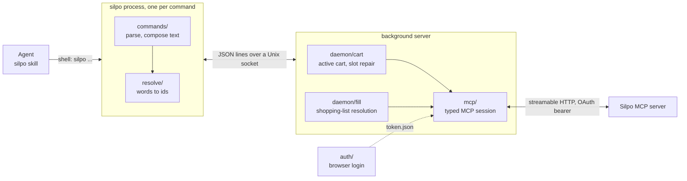

# silpo-cli

A token-frugal CLI client for the official [Silpo MCP server](https://ai-factory.silpo.ua/docs/mcp),
plus a Claude Code plugin whose skill teaches an agent to drive it.

Early prototype, built for the [Silpo AI Factory](https://ai-factory.silpo.ua/) hackathon. Requires
a Silpo account.

## Why

Silpo's MCP server exposes 40 tools and answers every call in JSON. An agent driving it directly
pays for that in three ways:

- **Every errand is a chain of calls.** "Deliver this cart to my address tomorrow" is
  `find_address`, then `get_available_delivery_types`, then `get_time_slots`, then
  `update_shopping_cart`, and every product lookup needs the branch, the delivery type and both
  ends of the timeslot passed back in by hand. Each link is one more step, and one more place for
  the agent to decide the request is under-specified and stop.
- **The payloads are large.** Product listings, category trees and branch lists arrive as JSON
  full of identifiers no other tool accepts, image links and pagination blocks. Everything the
  agent reads is re-sent as context on every later turn, so a fat result is paid for again and
  again; results too big to inline get spilled to files the agent then has to dig through.
- **Discovery is per tool.** Claude Code defers MCP schemas, so the agent spends a search step
  fetching schemas before it can call a tool it has not loaded yet.

The CLI changes that:

- **Resolution happens inside the CLI.** A shopping list, a destination given as words, a store
  near a landmark, a category named by title, a lapsed timeslot: the CLI does the lookups and the
  matching, and asks back only when more than one answer is plausible. Apart from `raw`, no
  command takes a JSON document, and no catalogue or cart command takes a branch, a delivery type
  or a timeslot: those come from the cart, set in words by `cart setup`.
- **Output is plain `key: value` lines,** holding only the fields a caller can act on.
- **One skill describes the whole surface,** loaded once when it fires, in place of per-tool
  schema discovery.

Every command that reaches Silpo does so through the same MCP endpoint over streamable HTTP,
authorized by OAuth, so the CLI can do nothing the MCP does not allow.

## How much it saves

Measured on 2026-09-13, end to end. Claude Code in headless mode ran fifteen errands (nine that
fill a cart, such as a breakfast for three with home delivery or a recipe scaled from a web page,
and six read-only questions, such as the cheapest ground coffee per kilogram or six peanut-free
sweets), three times each, on Claude Sonnet 5 and Claude Opus 5. Each errand ran once with this
plugin installed and once with only the Silpo MCP registered: 180 sessions, each from a clean
context and a reset cart, each verified afterwards to have touched only its own surface.

Medians over the 45 runs per model and surface:

| model | surface | tool calls | seconds | tool output, chars | input, full price | input, cached | cost, USD |
| --- | --- | ---: | ---: | ---: | ---: | ---: | ---: |
| Opus 5 | CLI + skill | 6 | 124 | 20 586 | 39 313 | 355 106 | 0.734 |
| Opus 5 | raw MCP | 12 | 145 | 83 089 | 68 532 | 822 126 | 1.248 |
| Sonnet 5 | CLI + skill | 5 | 106 | 21 116 | 42 842 | 364 424 | 0.314 |
| Sonnet 5 | raw MCP | 10 | 106 | 43 608 | 49 573 | 705 608 | 0.436 |

The same errands cost **41% less on Opus and 28% less on Sonnet** with the CLI, in half the tool
calls. Summed over all 180 sessions: $52.84 against $88.38, 42.5M against 95.6M input tokens
(2.25x), 585 against 1 126 tool calls.

It was also wrong less often. Each errand carries mechanical checks read off the cart the harness
fetched after the run, never off what the agent claimed: products present, delivery type, slot,
totals, cited fields. The CLI arm failed them in 3 of 90 runs, the MCP arm in 10 of 90.

The gap is widest in what the tools return and narrowest in time taken: the CLI arm is not doing
faster work, it is told less while doing it, and pays that saving again on every later turn. The
MCP arm had a result too large to inline in 45 of its 90 runs, and 102 of its 109 shell commands
were re-reading those spilled results; it also spent 49 steps, across 43 runs, searching for tool
schemas. Composite commands matter too. On the breakfast delivery, all three Sonnet runs on the
MCP stopped midway to ask the user a question and wrote nothing to the cart, while all three CLI
runs ran one `cart setup --to ... --when tomorrow` as their second step and finished with a full
cart. A question about allergens or nutrition is one `products find --details` call on the CLI and
one call per product card on the MCP, where some runs opened too few cards and answered from the
sample.

What the headline does not show:

- **Not every errand favours the CLI.** Of the 30 errand-and-model pairs, the MCP arm was cheaper
  in two: Sonnet on the peanut-free sweets ($0.29 against $0.33, a real if small win), and Sonnet on
  the breakfast delivery, where all three MCP runs stopped to ask a question and left the cart
  empty.
- **It is barely faster.** Median wall time was the same on Sonnet (106 s) and 1.17x shorter
  with the CLI on Opus.
- **The CLI arm has failures of its own.** Sonnet with the CLI failed the nutrition errand in all
  three runs: it never asked for product cards and answered from memory. In two errands,
  `cart setup --to` refused an address as ambiguous once in every run, costing a step each time.
- **The tool-output column is biased both ways.** It counts a spilled MCP result at the length of
  its stub, understating the MCP arm, and it leaves out the skill body (a median 23 321
  characters per run, more than the CLI arm's whole median tool output), understating the CLI
  arm. The input and cost columns include both.
- **Three runs per cell are few.** In 21 of the 60 errand-model-surface cells, the three runs
  disagreed by more than 2x on a headline metric. The direction across errands is the robust part;
  no single errand's ratio is.
- **The server drifts.** Runs share one live account and a catalogue that moves under them. The
  same suite run a day earlier gave median cost ratios of 1.62x (Opus) and 1.36x (Sonnet)
  against 1.70x and 1.39x here. The widening came from the MCP arm, whose median cost rose 13% on
  unchanged code (the CLI arm's rose 7%), partly server drift and partly a clause added to every
  prompt in between. Expect the ratio to move by several points between sittings.
- **Scope.** Read-only answers were checked for structure, not re-verified against the catalogue,
  and the fifteen errands were written by the author.

## Requirements

- Node.js >= 26: earlier versions lack `Temporal`, which the CLI uses at runtime. `.nvmrc` pins
  `26.3.0`.
- macOS or Linux: the CLI talks to its background server over a Unix domain socket.
- A Silpo account.

## Install

```bash
git clone https://github.com/alexanderhudym/silpo-cli && cd silpo-cli
npm install && npm run build && npm link
```

Then authorize once, through the browser:

```bash
silpo login
```

`--no-browser` prints the authorization URL instead of opening it, `--port` moves the local
callback off its default `53682`, and `--force` signs in again over valid stored tokens.

To uninstall: `npm unlink -g silpo-cli`.

## Commands

`silpo <command> --help` lists what any command takes.

| Command | What it does |
| --- | --- |
| `silpo login` / `logout` | Authorize via the browser; revoke and delete the stored tokens |
| `silpo me` | Profile, loyalty balance, premium subscription |
| `silpo me addresses` / `family` / `restrictions` | Saved addresses, household, dietary restrictions |
| `silpo me coupons` / `coupon <id>` | Available coupons; one coupon's terms and products |
| `silpo me promos` / `certificates` | Personal promotions and promo codes; gift certificates |
| `silpo me orders [--offline]` | Order history: online by default, in-store receipts with `--offline` |
| `silpo products find [query...]` | Product listing by text, category, promotion, set or favourites; `--details` adds each card |
| `silpo products card <product>` | Composition, nutrition, attributes |
| `silpo products favorite` / `unfavorite` | Save and unsave products, up to 5 per call |
| `silpo catalog [name...]` | Categories, promotions and sets in one listing |
| `silpo stores [query]` | Stores ranked by relevance to a settlement, address, coordinate or landmark |
| `silpo slots [--branch <uuid>]` | Delivery time slots of a branch, the cart's own by default |
| `silpo np <settlement> [--office <text>]` | Nova Poshta settlements, or the offices inside one matching a name |
| `silpo cart details` | Products, totals, delivery context, checkout links |
| `silpo cart fill <item...>` | Resolve a shopping list and write what resolved to the cart |
| `silpo cart set` / `remove` / `clear` | Change line quantities and comments; remove lines; empty the cart |
| `silpo cart setup` | Set delivery settings, and open the cart when the account has none |
| `silpo cart promo` / `bonus` / `adult` | Promo code, bonus request, age confirmation |
| `silpo cart certificate add` / `remove <barcode>` | Apply or take a gift certificate off the cart |
| `silpo raw <tool> [json]` | Call any MCP tool directly and print its structured payload as JSON |
| `silpo server` / `server test` / `server stop` | State of the background server; connect; stop it |
| `silpo config` / `config get` / `config set` | Effective settings; read one; change one |

A shopping list is free text, one item per argument, each item optionally carrying an amount or a
distinguishing percentage:

```bash
silpo cart fill "молоко 2,5%" "хліб" "яблука 1 кг" "яйця курячі 10 шт"
```

Where an item has more than one plausible match, or the branch holds less than was asked for,
`cart fill` prints the candidates and writes the rest; `--pick`, `--accept-stock` and
`--fill-with-alternatives` answer those questions on the next call, and `--dry-run` resolves
without writing.

Every catalogue and cart command reads its branch, delivery type and slot off the active cart, so
on an account that has never had one they fail with `this account has no shopping cart`.
`silpo cart setup --to <text>` opens one from a destination given as words, resolving the delivery
type, the branch, the address and a slot together. The text can be a saved address, a street
address, a store by its address or branch uuid, or a Nova Poshta settlement and office:

```bash
silpo cart setup --to "Київ, Хрещатик, 1" --delivery-type DeliveryHome --when tomorrow
```

## Output

An object prints one `key: value` per line, and a nested block sits under its key, indented. A list
prints its items as blocks separated by a blank line. A product listing hoists the `companyId`
shared by every item into a `common` block.

```
$ silpo products find "кока-кола"
Found 10 products

common
  companyId: 1ec88c5d-a050-669c-8467-570a157f3e31

id: 1ed07652-cfe4-6020-8604-c1af87aa927f
slug: napii-coca-cola-zero-692605
externalId: 692605
stock: 2072
Напій Coca-Cola Zero 0,5л — 39.49 ₴

id: 1ed075d5-8398-6158-8b9b-dd63763181f9
slug: napii-coca-cola-2500
externalId: 2500
stock: 602
Напій Coca-Cola 0,33л — 36.99 ₴
```

Identifiers are printed as the server gave them and passed back the same way. A product prints its
uuid, slug and external product id, and `products card`, `favorite` and `unfavorite` take any of
the three, while cart lines are named by uuid; a category is named by its slug; a branch, a company
and a Nova Poshta settlement or office by their uuids. Where a command cannot choose between
candidates it prints them rather than guessing. Only `raw`, and `server` and `config` with
`--json`, print JSON.

## Architecture



Each `silpo` invocation is a short-lived process. It parses its arguments with commander, resolves
whatever words it was given into server identifiers, and asks the background server to run the MCP
calls. The first command that needs the MCP spawns that server detached and reuses it afterwards;
it holds the one MCP session and the active cart. Structured results come back over the socket,
and the command composes its own `key: value` text from the fields it names.

| Module | Role |
| --- | --- |
| `src/cli.ts`, `src/program.ts` | Entry point and the commander program |
| `src/commands/` | One module per command group: options, calls, the text it prints |
| `src/resolve/` | Turning words into ids: list items, products, categories, promotions, sets, stores, destinations, Nova Poshta offices |
| `src/daemon/` | The background server, its socket protocol and client, the active cart and `cart fill`'s resolution |
| `src/mcp/` | The MCP SDK client over streamable HTTP, typed wrappers for the tools the CLI uses, rate-limit retry |
| `src/auth/` | OAuth login with dynamic client registration and PKCE, a loopback callback, token storage and revocation |
| `src/config/` | Settings and file locations |
| `src/utils/` | Parsing of dates, numbers and flags; `key: value` formatting |

Resolution runs in two places. `cart fill` resolves its list inside the background server, next
to the cart it writes to. Everything else, such as `products find`, `catalog`, `stores` and
`cart setup --to`, resolves in the command's own process, making each MCP call through the
background server. Products are found with the server's own batch search, expanded by word and
by transliteration, and ranked locally; categories, promotions and sets are matched against the
branch's own tables; a place is located through the server's address lookup and stores are ranked
by straight-line distance from it.

The background server re-reads the cart whenever a command needs it, so a change made elsewhere
is seen at once. A cart whose timeslot has lapsed is repaired with the first available slot before
use, on reads as well as writes; a cart that was checked out mid-session is reopened on the
settings it carried. A call the MCP server rejects as rate-limited is repeated up to three times,
after 1, 2 and 4 seconds, before the error reaches the caller. The background server exits after
`daemon.idleTimeout` without requests; `silpo server stop` and `silpo logout` stop it
immediately.

The behaviour of each part is specified in `openspec/specs`.

## Claude Code plugin

The repository doubles as a plugin marketplace:

```
/plugin marketplace add alexanderhudym/silpo-cli
/plugin install silpo@silpo
```

It installs one skill, `silpo`, which fires on anything to do with Silpo, and one slash command,
`/silpo:login`, which walks through `silpo login`. The plugin does not install the CLI itself:
`silpo` has to be on the `PATH` (see [Install](#install)).

## Configuration

`silpo config` prints the effective settings; `silpo config set <key> <value>` changes one.

| Key | Default | What it controls |
| --- | --- | --- |
| `daemon.idleTimeout` | `10m` | How long the background server stays alive without requests; a duration such as `5m`, `300s` or `90000ms`, a bare number being minutes |
| `mcp.baseUrl` | `https://mcp.silpo.ua/mcp` | The MCP endpoint the background server connects to |

`SILPO_HOME` moves where the CLI keeps its settings (`config.json`), its tokens (`token.json`) and
the background server's log (`daemon.log`); the default is `~/.silpo`.

## Development

```bash
npm run build    # tsc into dist/
npm test         # builds, then runs test/**/*.test.ts on node:test
```

The tests run the built CLI against a fake background server that serves recorded payloads. They
check what the CLI prints, not what the live server accepts.

## Built with Claude Code

This project was written together with [Claude Code](https://claude.com/claude-code), Anthropic's
agentic coding tool: design, implementation, tests and the plugin's skill were developed in pair
sessions with it, and the benchmark above was run through it.

## License

[MIT](LICENSE). Not affiliated with or endorsed by Silpo or Fozzy Group; the Silpo name is used
only to identify the service this client talks to.

The MIT license covers the code. The test fixtures hold data returned by the Silpo MCP server
(product names, prices, store addresses, category and promotion titles); that data belongs to its
owners and is included only as test input.

`.claude/skills/openspec-*` and `.claude/commands/opsx/` are generated by
[OpenSpec](https://github.com/Fission-AI/OpenSpec), MIT License, Copyright (c) 2024 OpenSpec
Contributors.
